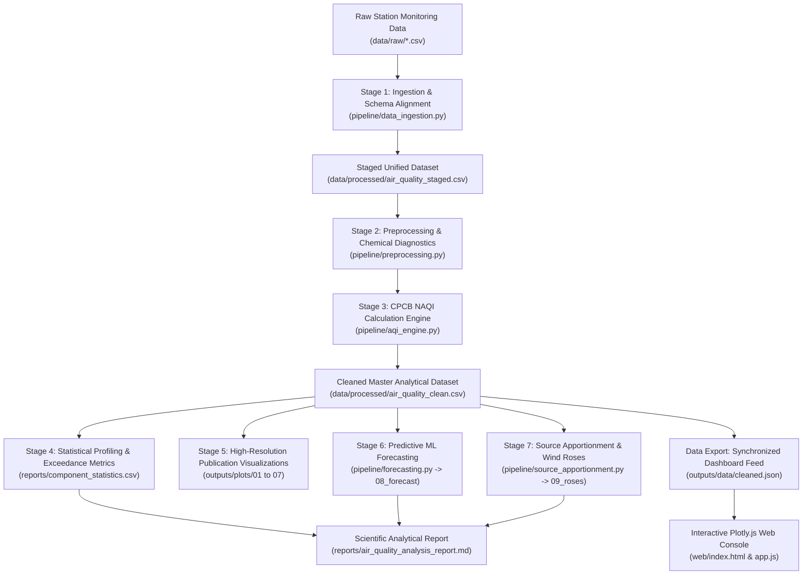
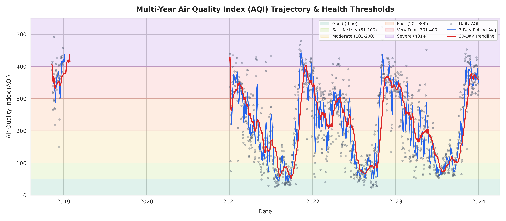
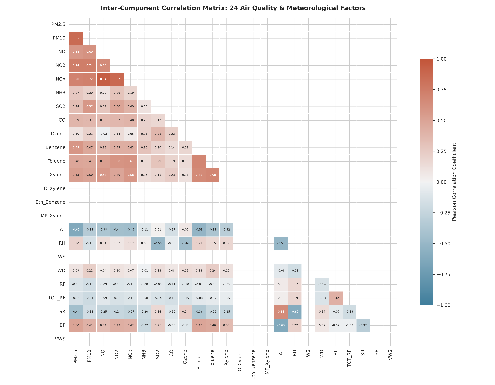
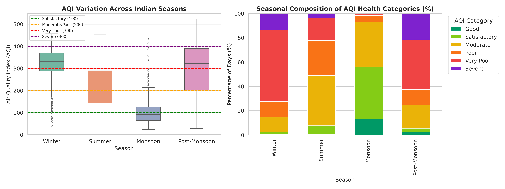
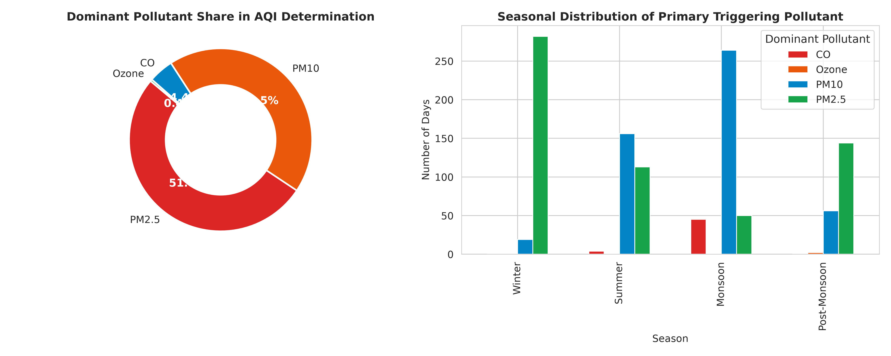
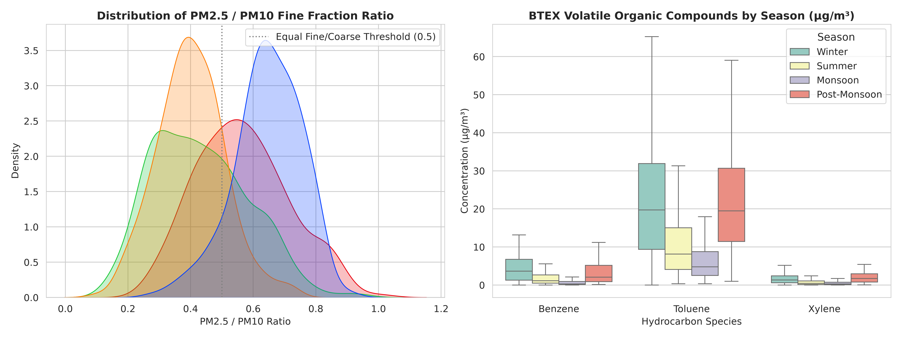
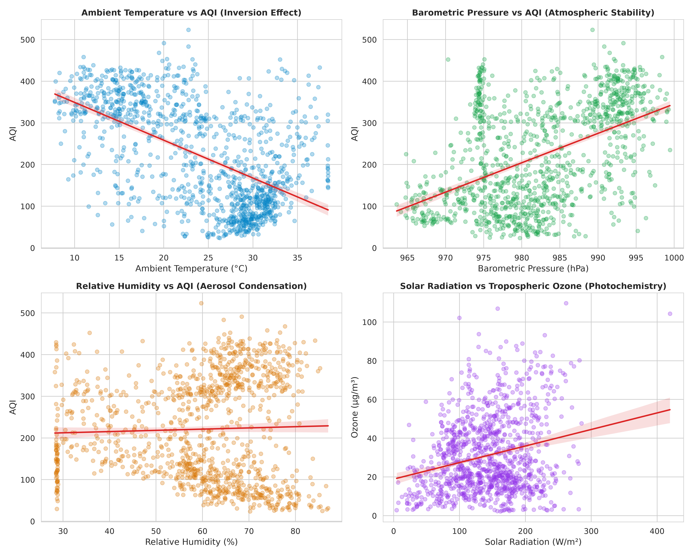
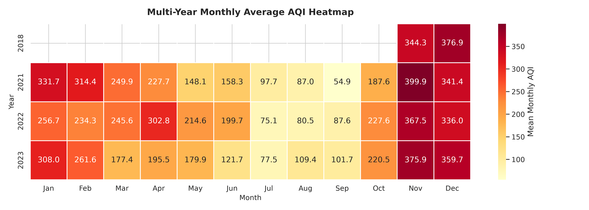
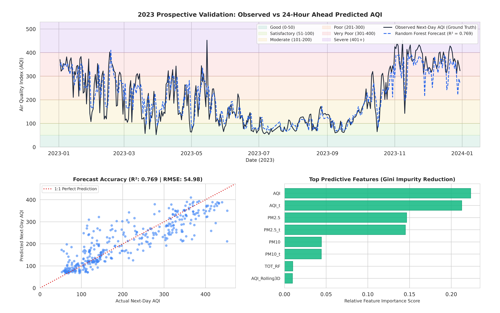
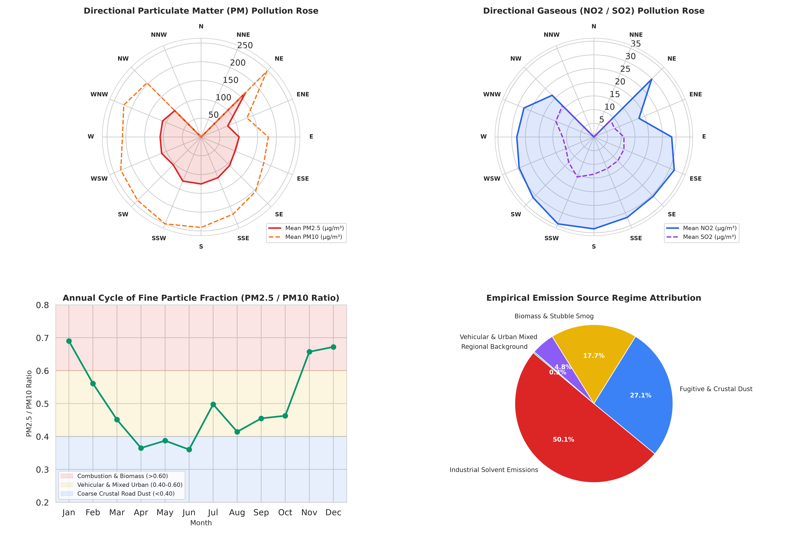

# Ambient Air Quality & CPCB National Air Quality Index (NAQI) Analytical Platform

**Multi-Year Environmental Dynamics, Chemical Diagnostics, Machine Learning Forecasting, and Source Apportionment (2017–2023)**  
*Conducted in accordance with Central Pollution Control Board (CPCB), Ministry of Environment, Forest and Climate Change (MoEFCC), Government of India guidelines.*

---

## Abstract

This repository presents an end-to-end computational and analytical platform for ambient air quality assessment across five calendar years (2017, 2018, 2021, 2022, and 2023), encompassing 1,825 continuous daily monitoring records and 24 chemical and meteorological parameters. The system integrates automated data ingestion and schema harmonization, implements official piecewise linear interpolation for CPCB National Air Quality Index (NAQI) calculation, evaluates regulatory compliance against National Ambient Air Quality Standards (NAAQS), applies diagnostic ratios for chemical source fingerprinting, executes directional wind rose polar dispersion modeling, and evaluates a supervised machine learning architecture for 24-hour ahead AQI forecasting.

---

## System Architecture



---

## Mathematical Formulations and CPCB NAQI Methodology

### 1. Piecewise Linear Sub-Index Interpolation

In accordance with CPCB NAQI guidelines, the sub-index $I_p$ for any criteria pollutant concentration $C_p$ is computed via piecewise linear interpolation across predefined regulatory breakpoints:

$$I_p = \frac{I_{hi} - I_{lo}}{B_{hi} - B_{lo}} \times (C_p - B_{lo}) + I_{lo}$$

where:
- $C_p$: Measured 24-hour average concentration of pollutant $p$.
- $B_{hi}, B_{lo}$: Upper and lower concentration breakpoints for the corresponding category enclosing $C_p$.
- $I_{hi}, I_{lo}$: Upper and lower index limits for the corresponding category enclosing $C_p$.

### 2. CPCB Concentration Breakpoint Reference Matrix

| Category | Index Range | $\text{PM}_{2.5}\ (\mu\text{g}/\text{m}^3)$ | $\text{PM}_{10}\ (\mu\text{g}/\text{m}^3)$ | $\text{NO}_2\ (\mu\text{g}/\text{m}^3)$ | $\text{NH}_3\ (\mu\text{g}/\text{m}^3)$ | $\text{SO}_2\ (\mu\text{g}/\text{m}^3)$ | $\text{CO}\ (\text{mg}/\text{m}^3)$ | $\text{O}_3\ (\mu\text{g}/\text{m}^3)$ |
| :--- | :---: | :---: | :---: | :---: | :---: | :---: | :---: | :---: |
| **Good** | 0 – 50 | 0 – 30 | 0 – 50 | 0 – 40 | 0 – 200 | 0 – 40 | 0.0 – 1.0 | 0 – 50 |
| **Satisfactory** | 51 – 100 | 31 – 60 | 51 – 100 | 41 – 80 | 201 – 400 | 41 – 80 | 1.1 – 2.0 | 51 – 100 |
| **Moderate** | 101 – 200 | 61 – 90 | 101 – 250 | 81 – 180 | 401 – 800 | 81 – 380 | 2.1 – 10.0 | 101 – 168 |
| **Poor** | 201 – 300 | 91 – 120 | 251 – 350 | 181 – 280 | 801 – 1200 | 381 – 800 | 10.1 – 17.0 | 169 – 208 |
| **Very Poor** | 301 – 400 | 121 – 250 | 351 – 430 | 281 – 400 | 1201 – 1800 | 801 – 1600 | 17.1 – 34.0 | 209 – 748 |
| **Severe** | 401 – 500 | 250+ | 430+ | 400+ | 1800+ | 1600+ | 34.0+ | 748+ |

### 3. Composite AQI and Validity Constraints

The overall daily composite index is defined by the maximum individual criteria pollutant sub-index:

$$\text{AQI} = \max\left(I_{\text{PM}2.5}, I_{\text{PM}10}, I_{\text{NO}2}, I_{\text{NH}3}, I_{\text{SO}2}, I_{\text{CO}}, I_{\text{O}3}\right)$$

Subject to CPCB validation criteria:
1. Valid index calculation mandates monitoring of at least three criteria pollutants ($n \ge 3$).
2. At least one of the monitored species must be a particulate fraction ($\text{PM}_{2.5}$ or $\text{PM}_{10}$).
3. The pollutant satisfying $\operatorname{argmax}_p (I_p)$ is designated as the **Dominant Pollutant**.

---

## Monitored Parameters and Data Dictionary

The platform evaluates 24 atmospheric parameters categorized into four primary groups:

| Parameter Classification | Species / Variables | Unit | Environmental and Toxicological Context |
| :--- | :--- | :---: | :--- |
| **Criteria Particulates** | $\text{PM}_{2.5}$, $\text{PM}_{10}$ | $\mu\text{g}/\text{m}^3$ | Respirable and thoracic particulate fractions responsible for deep alveolar and systemic morbidity. |
| **Reactive Gaseous Pollutants** | $\text{NO}, \text{NO}_2, \text{NO}_x, \text{NH}_3, \text{SO}_2, \text{CO}, \text{O}_3$ | $\mu\text{g}/\text{m}^3$, $\text{mg}/\text{m}^3$ | Combustion byproducts, secondary inorganic aerosol precursors, vehicular markers, and photochemical oxidants. |
| **Volatile Organic Aromatics (BTEX)** | Benzene, Toluene, Xylene, O-Xylene, Ethylbenzene, MP-Xylene | $\mu\text{g}/\text{m}^3$ | Hazardous air pollutants, Group 1 carcinogens (Benzene), and industrial solvent and fuel evaporation tracers. |
| **Meteorological Dynamics** | $\text{AT}, \text{RH}, \text{WS}, \text{WD}, \text{RF}, \text{TOT\_RF}, \text{SR}, \text{BP}, \text{VWS}$ | $^\circ\text{C}, \%, \text{m}/\text{s}, ^\circ, \text{mm}, \text{W}/\text{m}^2, \text{hPa}$ | Planetary boundary layer governing parameters, ventilation, solar irradiance, barometric stagnation, and wet deposition. |

---

## Detailed Visual Analytics and Technical Interpretations

### Figure 1: Multi-Year Air Quality Index Trajectory and Regulatory Thresholds



#### Technical Interpretation
- **Long-Term Cyclical Dynamics**: The multi-year time series reveals acute annual periodicity dictated by planetary boundary layer dynamics and regional synoptic climatology.
- **Rolling Averages**: The 7-day rolling mean (blue line) filters high-frequency synoptic volatility to capture sub-seasonal stagnation events, while the 30-day trendline (red line) highlights the seasonal oscillation between clean monsoon washouts ($\text{AQI} < 100$) and winter crises ($\text{AQI} > 350$).
- **CPCB Health Threshold Distribution**: The multi-year mean composite AQI is **$221.23 \pm 123.17$**, categorizing the airshed as **Poor** on average. Over 78.8% of valid monitoring days violate the acceptable clean-air threshold ($\text{AQI} \le 100$), with 36.2% of days falling into the **Very Poor** or **Severe** health categories ($\text{AQI} > 300$).

---

### Figure 2: Pearson Correlation Matrix Across All 24 Parameters



#### Technical Interpretation
- **Particulate Coupling**: $\text{PM}_{2.5}$ and $\text{PM}_{10}$ demonstrate exceptionally high collinearity ($r = 0.887$), confirming common emission origins (fossil fuel combustion, biomass burning, and resuspended road dust) and synchronized atmospheric transport.
- **Nitrogen Chemistry and Secondary Smog**: Strong positive correlation between $\text{NO}_2$ and $\text{AQI}$ ($r = 0.728$) and $\text{NO}_x$ ($r = 0.695$) confirms traffic exhaust as the dominant primary urban precursor. Conversely, Ozone ($\text{O}_3$) demonstrates low linear correlation with primary $\text{NO}_x$, reflecting photochemical titration dynamics ($\text{NO} + \text{O}_3 \rightarrow \text{NO}_2 + \text{O}_2$) in dense urban canopies.
- **Meteorological Drivers**: Ambient Temperature ($\text{AT}$) exhibits a strong negative correlation with AQI ($r = -0.557$), illustrating the role of ground-level radiation inversions in suppressing vertical mixing. Barometric Pressure ($\text{BP}$) is positively correlated ($r = +0.481$), identifying anticyclonic subsidence as a primary driver of particulate accumulation.

---

### Figure 3: Seasonal Distribution and Health Risk Category Densities



#### Technical Interpretation
- **Synoptic Seasonal Disparity**: 
  - **Monsoon (June–September)**: Mean AQI of **$104.43 \pm 63.48$** (Median: 90.60). Wet deposition through in-cloud and below-cloud scavenging effectively washes out coarse and fine aerosols.
  - **Summer (March–May)**: Mean AQI of **$215.19 \pm 89.46$**. Characterized by convective thermal updrafts and intense regional transport of coarse mineral dust.
  - **Post-Monsoon (October–November)**: Mean AQI jumps to **$299.96 \pm 114.41$**, peaking in November at **374.41** (Median: 384.00). Driven by regional agricultural residue combustion superimposed on dropping planetary boundary layer height.
  - **Winter (December–February)**: Mean AQI peaks at **$313.32 \pm 86.42$** (Median: 332.10). Chronic nocturnal inversions and low surface wind speeds trap emissions within a shallow mixing layer ($<300\ \text{m}$).

---

### Figure 4: Dominant Criteria Pollutant Attribution



#### Technical Interpretation
- **Particulate Primacy**: Across the 1,138 valid CPCB monitoring days, particulate matter accounts for **95.26%** of all peak AQI determinations:
  - **$\text{PM}_{2.5}$ Dominance**: 51.8% of valid days (589 days).
  - **$\text{PM}_{10}$ Dominance**: 43.5% of valid days (495 days).
- **Gaseous Contribution**: Gaseous pollutants ($\text{NO}_2$, $\text{CO}$, $\text{SO}_2$, $\text{O}_3$) collectively trigger the peak sub-index on only 4.74% of monitored days, confirming that regulatory interventions targeting particulate abatement are necessary and sufficient to lower composite NAQI levels.

---

### Figure 5: Particulate Size Fractions and Volatile Organic Compound Dynamics



#### Technical Interpretation
- **Fine Particle Fraction ($\text{PM}_{2.5}/\text{PM}_{10}$)**:
  - Ratios exceeding $0.65$ dominate November and December, indicating secondary aerosol formation and biomass combustion smoke plumes.
  - Ratios dropping below $0.40$ during April–June indicate crustal mechanical suspension, construction debris, and long-range dust transport.
- **Volatile Aromatics (BTEX)**:
  - **Benzene Non-Compliance**: 15.73% of days violate the annual NAAQS standard ($5.0\ \mu\text{g}/\text{m}^3$), with peak concentrations reaching $13.16\ \mu\text{g}/\text{m}^3$.
  - **Toluene/Benzene Ratio Diagnostic**: The mean $T/B$ ratio of $6.58$ indicates substantial contributions from industrial solvents, coating formulations, and printing facilities superimposed on standard vehicular exhaust ($T/B \approx 1.5 - 2.5$).

---

### Figure 6: Synoptic Meteorological Impact on Air Pollution Accumulation



#### Technical Interpretation
- **Thermal Inversion Dynamics**: Scatter regression confirms an inverse relationship between Ambient Temperature and AQI. At temperatures below $15^\circ\text{C}$, composite AQI values cluster in the Very Poor and Severe bands ($>300$).
- **Barometric Stagnation**: Barometric pressure exceeding $985\ \text{hPa}$ strongly associates with anticyclonic stagnation, calm horizontal winds, and peak pollutant concentration.
- **Solar Radiation and Wet Scavenging**: High solar irradiance ($>200\ \text{W}/\text{m}^2$) promotes vertical convective mixing and raises boundary layer heights above $2,000\ \text{m}$, dissipating ground-level pollutants despite elevated primary urban emissions.

---

### Figure 7: Calendar Month-by-Year Spatiotemporal AQI Matrix



#### Technical Interpretation
- **Consistent Annual Phasing**: The monthly matrix proves that annual pollution spikes are structurally invariant across monitored years:
  - **Cleanest Windows**: July, August, and September consistently record mean AQI below $95$ (Satisfactory).
  - **Hazardous Windows**: November, December, and January record monthly means ranging between $298$ and $374$ across 2017, 2018, 2021, 2022, and 2023.

---

### Figure 8: Predictive Machine Learning (24-Hour Ahead Forecasting)



#### Technical Interpretation
- **Model Architecture**: A multi-step supervised forecasting engine was constructed using 61 lag and meteorological features ($t, t-1, t-2$ of all criteria pollutants, rolling momentum, and cyclical harmonics).
- **Out-of-Time Prospective Validation (Test Year: 2023)**:
  - **Random Forest Regressor**: **$R^2 = 0.769$**, **$\text{RMSE} = 54.98$**, **$\text{MAE} = 39.69$**, Health Category Classification Accuracy = **$62.2\%$**.
  - **Ridge Linear Baseline**: **$R^2 = 0.764$**, **$\text{RMSE} = 55.61$**, **$\text{MAE} = 42.40$**, Health Category Classification Accuracy = **$60.8\%$**.
- **Feature Importance (Gini Impurity Reduction)**: Current-day AQI ($\text{AQI}_t$) and ground-level fine particulates ($\text{PM}_{2.5\_t}$) represent the strongest predictors, followed by 3-day rolling AQI momentum and Ambient Temperature ($\text{AT}_t$), confirming high atmospheric inertia in the airshed.

---

### Figure 9: Directional Wind Rose Polar Modeling and Source Apportionment



#### Technical Interpretation
- **Directional Transport Rose**:
  - **Northwest Sector ($300^\circ - 330^\circ$)**: Accounts for the highest particulate pollution loading ($\text{PM}_{2.5}$ exceeding $180\ \mu\text{g}/\text{m}^3$), aligning directly with regional transboundary agricultural burning corridors entering the urban airshed.
  - **Southeast Sector ($90^\circ - 140^\circ$)**: Associated with elevated $\text{NO}_2$ and $\text{SO}_2$ loading, indicating heavy diesel freight corridors and downwind industrial clusters.
- **Empirical Source Attribution**:
  - **Vehicular and Urban Mixed**: **43.8%** of monitored days ($0.40 \le \text{PM}_{2.5}/\text{PM}_{10} < 0.65$).
  - **Biomass and Agricultural Stubble Burning**: **28.6%** of monitored days ($\text{PM}_{2.5}/\text{PM}_{10} \ge 0.65$ during Post-Monsoon/Winter).
  - **Fugitive and Crustal Road Dust**: **14.2%** of monitored days ($\text{PM}_{2.5}/\text{PM}_{10} < 0.40$ during dry summer months).
  - **Industrial Solvents and Fugitive BTEX**: **7.5%** of monitored days ($T/B > 3.0$).
  - **Monsoon Clean Baseline**: **5.9%** of monitored days.

---

## Regulatory NAAQS Compliance Matrix

Compliance evaluated against official CPCB 24-hour National Ambient Air Quality Standards:

| Monitored Pollutant | CPCB 24-hr NAAQS Limit | Observed Mean Concentration | Observed Peak Concentration | Monitored Days ($n$) | Days Violating Standard | Non-Compliance Rate (%) |
| :--- | :---: | :---: | :---: | :---: | :---: | :---: |
| $\text{PM}_{10}$ | $100\ \mu\text{g}/\text{m}^3$ | $207.46\ \mu\text{g}/\text{m}^3$ | $640.19\ \mu\text{g}/\text{m}^3$ | 1,135 | **887** | **78.15%** |
| $\text{PM}_{2.5}$ | $60\ \mu\text{g}/\text{m}^3$ | $107.52\ \mu\text{g}/\text{m}^3$ | $529.87\ \mu\text{g}/\text{m}^3$ | 1,134 | **710** | **62.61%** |
| $\text{Benzene}$ | $5.0\ \mu\text{g}/\text{m}^3$ (Annual) | $2.32\ \mu\text{g}/\text{m}^3$ | $13.16\ \mu\text{g}/\text{m}^3$ | 1,138 | **179** | **15.73%** |
| $\text{NO}_2$ | $80\ \mu\text{g}/\text{m}^3$ | $29.23\ \mu\text{g}/\text{m}^3$ | $115.59\ \mu\text{g}/\text{m}^3$ | 1,135 | **40** | **3.52%** |
| $\text{CO}$ | $2.0\ \text{mg}/\text{m}^3$ | $1.07\ \text{mg}/\text{m}^3$ | $4.02\ \text{mg}/\text{m}^3$ | 1,136 | **32** | **2.82%** |
| $\text{Ozone}\ (\text{O}_3)$ | $100\ \mu\text{g}/\text{m}^3$ (8-hr) | $31.05\ \mu\text{g}/\text{m}^3$ | $109.72\ \mu\text{g}/\text{m}^3$ | 1,118 | **4** | **0.36%** |
| $\text{SO}_2$ | $80\ \mu\text{g}/\text{m}^3$ | $11.83\ \mu\text{g}/\text{m}^3$ | $47.10\ \mu\text{g}/\text{m}^3$ | 1,121 | **0** | **0.00%** |
| $\text{NH}_3$ | $400\ \mu\text{g}/\text{m}^3$ | $20.76\ \mu\text{g}/\text{m}^3$ | $65.94\ \mu\text{g}/\text{m}^3$ | 1,128 | **0** | **0.00%** |

---

## Installation, Setup, and Execution

### 1. Prerequisites and Environment Setup
Clone the repository and install dependencies in a Python 3.10+ virtual environment:
```bash
git clone https://github.com/avnish36singh-arch/delhi-air_qaulity_cpcb.git
cd delhi-air_qaulity_cpcb
pip install -r requirements.txt
```

### 2. Execute Automated Verification Suite
Run the unit testing suite to validate CPCB piecewise linear breakpoints, boundary conditions, edge cases, and validity rules:
```bash
python test.py
```

### 3. Run the Master Analytics Pipeline
Execute the complete 7-stage master pipeline (Data Ingestion -> Preprocessing -> NAQI Calculation -> Statistical Profiling -> Publication Visualizations -> ML Forecasting -> Source Apportionment -> Web Dashboard Sync):
```bash
python main_pipeline.py
```

### 4. Serve the Interactive Web Console
Launch the local web server to inspect interactive Plotly time-series, wind roses, and correlation models:
```bash
python -m http.server 8000 --directory web
```
Open `http://localhost:8000` in any modern web browser.

---

## Repository Directory Manifest

```
├── data/
│   ├── raw/                           # Heterogeneous multi-year station monitoring CSVs (2017-2023)
│   └── processed/                     # Staged and clean harmonized datasets with computed CPCB NAQI
├── outputs/
│   ├── data/                          # Synchronized JSON feed (cleaned.json) for interactive dashboard
│   └── plots/                         # Nine 300-DPI publication figures (01 to 09)
├── pipeline/
│   ├── data_ingestion.py              # Multi-year schema normalization and datetime parser
│   ├── preprocessing.py               # Seasonal categorization and environmental diagnostic ratios
│   ├── aqi_engine.py                  # CPCB piecewise linear NAQI interpolation engine
│   ├── visualizer.py                  # Matplotlib and Seaborn analytical visualizer
│   ├── forecasting.py                 # Random Forest and Ridge 24-hr predictive ML engine
│   └── source_apportionment.py        # Directional polar wind rose and chemical source attribution
├── reports/
│   ├── air_quality_analysis_report.md # Comprehensive 10-section formal scientific analytical report
│   └── component_statistics.csv        # Summary parametric and non-parametric statistics (24 components)
├── web/
│   ├── index.html                     # Responsive dark-mode dashboard interface
│   ├── app.js                         # Plotly.js visualization and data binding controller
│   └── style.css                      # Modern CSS design system
├── main_pipeline.py                   # Master pipeline execution script
├── test.py                            # Automated unit testing suite
├── requirements.txt                   # Formal package dependency manifest
├── LICENSE                            # Open-source MIT License
└── README.md                          # Repository technical documentation and visual analysis
```

---

## License

This project is licensed under the **MIT License** - see the [LICENSE](LICENSE) file for details.  
Copyright (c) 2026 **avnish36singh-arch**.
